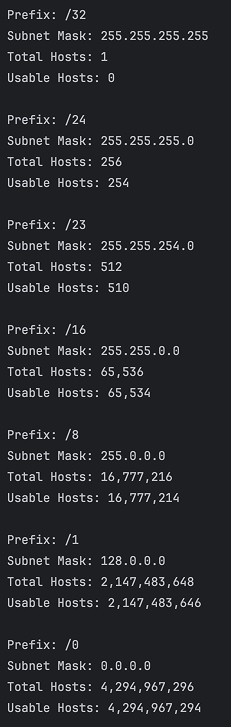

## 🚀 CCNA Subnetting Engine (Java)

<h4> Why I Built This</h4>

I’m currently a Junior IT major with a Software Engineering minor, and studying for my CCNA.

Subnetting is the "language" of networking, but manually calculating host ranges and masks for every single lab was slowing me down.
  So I decided to stop doing the math on paper and start building the logic in code. 
 This tool is my "automated study buddy" that ensures my network designs are mathematically perfect.

This tiny project started as a messy, hardcoded script I wrote during a 17-hour Sunday shift at work.  It worked, but was very buggy.

I scrapped the whole thing and rebuilt it from scratch during an 8:00 AM class a few days after.

### Version 1.0 Console Output Preview  

### Dynamic  Logic: 
Moved away from rigid "Class A/B/C" objects to a single mathematical engine.  
### Scalability: 
Implemented File I/O so I can process every prefix from /32 down to /0 in one go.
### Precision: 
Swapped to long data types to handle the full 4.2 billion IPv4 address space without integer overflow.
Features
### Modern Java: 
Uses the latest switch expressions and printf formatting for clean, readable output.
### Edge Case Handling: 
Correctly identifies usable hosts for /31 and /32 networks.
### Batch Processing: 
Reads prefixes from a .dat file and generates a full report in results.dat.
### Tech Stack
Language: Java (JDK 23)  
Concepts: CIDR Logic, Bitwise Math, Object-Oriented Programming (OOP), File I/O
